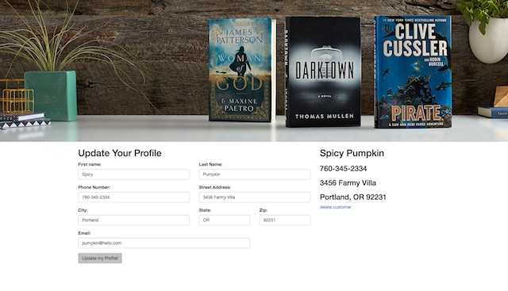
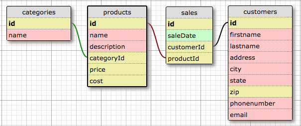

# Amazon Spark
Version 0.0.0: September 26, 2016

by [Karen Freeman-Smith](https://github.com/karenfreemansmith) and [Vanessa Palacios Sharma](https://github.com/VanessaSharma)

## Description
An online bookstore

### Specifications
#### User Stories:
* As a business owner, I want to I want to create read, update, delete, and list products in the catalog, so that we can keep track of our inventory.
* As a customer, I want to search for a product by name or other attribute, so that I can find what I'm looking to buy.
* As a customer, I want to be able to purchase a product, and receive an invoice or receipt summarizing the purchase. (For now, assume a customer can only purchase a single item at once).
* As a customer, I want to see a history of all purchases I've made at this business.
* As a business owner, I want to see a list of all sales I've made.
* As a business owner, I want to generate a report of sales I've made in the last 30 days.
* As a business owner, I want to see a list of sales I've made in the last quarter (quarters are generally about 65 days).
* As a business owner, I want to see the total amount of sales I've made in the last 30 days.
* As a business owner, I want to see the total amount of salves I've made in the last quarter.
* As a business owner, I want to set a sales goal for each 30 or 65 day period (Hint: This could be a constant) and see how close I am to reaching that goal.
* As a business owner, I want to search for customers by name, in case they have questions about their order.
* As a customer, I want to receive an error message if I bookmark a product page for a product the store no longer carries.

#### Database Diagram:

#### Technical Specifications:
 | Behavior                                       | Input                                              | Output                                             |
|------------------------------------------------|----------------------------------------------------|----------------------------------------------------|
| Store category name                            | fantansy                                           | fantansy                                           |
| Assign an id to category                       | 1                                                  | 1                                                  |
| Get name of product                            | My Little Dragon                                   | My Little Dragon                                   |
| Get description of product                     | A fantastic story about a little dragon in Narnia. | A fantastic story about a little dragon in Narnia. |
| Assign a category id                           | 1                                                  | 1                                                  |
| Get product cost                               | 2                                                  | 2                                                  |
| Get product price                              | (equals costs) 2                                   | (cost * 2) 4                                       |
| Get sale date                                  | 09/26/2016                                         | 09/26/2016                                         |
| Assign a customer id                           | 1                                                  | 1                                                  |
| Assign a product id                            | 1                                                  | 1                                                  |
| Get customer first name                        | Jane                                               | Jane                                               |
| Get customer last name                         | Austin                                             | Austin                                             |
| Get customer address                           | 123 Fantasy Lane                                   | 123 Fantasy Lane                                   |
| Get customer city                              | Portland                                           |  Portland                                          |
| Get customer state                             | Oregon                                             | Oregon                                             |
| Get customer zip                               | 97255                                              | 97255                                              |
| Get customer phone number                      | 760-457-7306                                       | 760-457-7306                                       |
| Get customer email                             | janeaustin@hotmail.com                             | janeaustin@hotmail.com                             |
| Get all sales for date range                   | 30 days                                            | list of sales in past 30 days                      |
| Get list of sales for customers for date range | 30 days                                            | list of sales in past 30 days                      |

## Setup/Installation
* Clone directory
* Setup database in PSQL:
  * ...
* Type 'gradle run' inside the directory
* Navigate to 'http://localhost:4567'

## Support & Contact
For questions, concerns, or suggestions please email karenfreemansmith@gmail.com

## Known Issues
* N/A

## Technologies Used
Java, JUnit, Spark, PostgreSQL, Gradle

## Legal
*Licensed under the GNU General Public License v3.0*

Copyright (c) 2016 Copyright _Karen Freeman-Smith_ All Rights Reserved.
